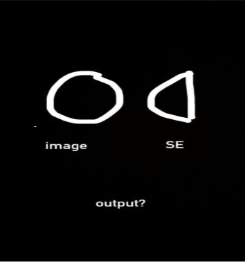

# DIP Viva

**Ehsan:**  

- m*n image e laplacian filter apply korle output image er avg intensity koto hbe
  - **Ans**: Average intensity becomes almost 0 as laplacian as gives one high and one low response for each edge. Thus the average is close to zero but not exacly 0.
- Fftshift 2 bar na kore ifft use kore filter diagonal swap kn kori (+1)
  - **Ans**:No particular reason, gpt says both operations result in the same outcome.
- P ke I diye erosion :
  - **Ans**: Overlaps at leftmost region thus there is a center there.

**Saqif:**

- Ekta image ke box filter(without averaging) diye convolve kprle jei img ashbe oitar intensity summation koto (+1).
  - **Ans**: If the box filter is 3*3, then without averaging the convolution adds 9 neighboring pixel, thus the intensity should be 9 times.  
- erosion diye kemne expand kora jay, without using complements(just change the values)
  - **Ans**: If the erosion kernel has a center outside of the 1 pixels then it might be used to expand the image on one side.
  - **ANS**:
    - First option is to invert the image and do dilation to mimmic erosion
    - Second option same as previous question a SE with a center not in the SE might shrink image from one side.
- Ekta image ke fourier transform korle without 1/mn then oi transformed image ar arekta image jekhane original image er charpashe 0 padding ase oitake same bhabe fourier transform korle f(0,0) te ki same thakbe naki? (+1)
  - **Ans**: No padding changes the dimensions thus the avergage value would be lower.
- Fourier transform linear naki? Keno linear?
  - **ans** Fourier transform linear, as it can be performed through convolution of its kernel with the image.
- 2ta image ke fourier transform kore add kora ar add kore fourier transform korle ki same ashbe naki?
  - **ans** Yes same, as linear.

**Salvi:**

- Ekta image er gradient response ki:
  - **Ans**: First derivative, positive value where intensity changes.
- Ekta image er shob 0 values. Etay histogram equalization korle output image ta kemon hobe?
  - **Ans**: All values will be mapped to 1.
- -pi/2 theke +pi/2 range r 0 to 180 range. Ekhane theta r rho values kemon hobe 
  - **Ans:** rho values will always remain positive. The hough space is just shifted by pi/2 units.
- Gradient ke morphologically kibhabe ber korbo?
  - **Ans:** Do erosion, then subtract from original image or from the dilation of image.

**Radib:**

- How to smooth image using morphological operations?
  - **Ans:** To smooth an image using morphological operations, you can apply morphological opening (erosion followed by dilation) to remove small noise or morphological closing (dilation followed by erosion) to fill small gaps and smooth boundaries. For better smoothing, a combination of both opening and closing can be used. The choice of structuring element (kernel) size and shape affects the level of smoothing—larger kernels provide stronger smoothing.
- How to remove salt and paper noises without using smoothing filter
  - **Ans**:
    - Do morphological smoothing.

**Ramisa:**

- Sharpening using morphological filter.
  - **Ans**: Find the morphological gradient instead of the usual gradient then add it to the original image.
- When will histogram equalisation not have any effect.
  - **ANS**: When the Historgam is already flat and the image has pixels in all the bins equally.
- Sampling-quantization image’er exactly kon jinishta affect kore.
  - **Ans**:
    - Sampling: Spatial resolutin
    - Quantization: Intensity resolution
- RGB better naki HSV, human perception e ken bhalo
  - **ans** HSV is better because we perceive colors through its saturation.Humans describe any color as less or more saturated.
- When will median filter not have any effect
  - **ans** If more than 50% of pixel is corrupted.
- What is the output in the below figure? (+1)
  - 
  - **ANS**: SE intersets with just the left half of the circle thus only one center pixel comes in erosion.
  
**Shajeed:**

- Differentiate between fftshift and ifftshift (not je akta arektar ulta)
  - **ANS:**
    - fftshift: shifts $f(x,y)$ to $f(x-M/2,y-N/2)$
    - ifftshift: shifts $f(x,y)$ to $f(x+M/2,y+N/2)$
    - Doing both returns back the original image
- How to do morphological smoothing?
  - **Ans**: Opening removes small noises that are high in magnitude. Closing removes noises that are darker in magnitude. Small SE should be used.
- Ringing effect why?
  - F domain filters when taken to Space domain behaves like a sinc function. Conv with sinc function causes Ringing effect.
- Ideal filter diye notch kemne implement korba?
  - Only the center pixel becomes 0.

**Nahin:**

- h1 ekta filter jeta magnitude calculate kore, h2 laplacian calculate kore. Emon kuno filter banano jbe kina duita ekshathe calculate korbe, mne h1*h2
  - **Ans:** Jbe na cz magnitude calculation er filter ta non linear
- h1 and h2 er order change korle same result ashbe kina
  - **Ans** : No as the mag calculation is nonlinear.
- Salt and pepper noise kemne remove kore
  - **ANs**:
    - Median Filtering
    - Sequencial opening and closing
- Sampling and quantization er effect ki
  - **Ans:** Resolution and intensity affect kore

**Labiba**:

- Dilation diye kivabe erosion effect ana jabe
  - **ANS:** Invert and do dilation then revert

- Image jodi BGR hishebe read kora hoy and etar upor smoothing kora hoy tahole ki RGB theke different kono output ashbe naki (+1)
  - **ANS** NO as smoothing is linear and can be done on all channels individually. 
- Erosion korle to output point gulo within object thake, emon kono case ache ki jokhn outside the object thakte pare output point.
  - **ANS** yes if the SE is not symmetric and does not cover the center pixel.
- 50% er beshi noise thakleu median filter ki thik vabe kaj korte parbe naki, emon kono case ki ache
  - **ANS**: If all the noise of an image is gathered in a single region then apart from that region the other regions will be smoother.

- ILF er sinc function akay jiggesh korse etar frequency response ki and HLF er sinc function dekhte kemon hoito
  - **Ans** Freq response is ringing effect for ILPF.
  - Sinc function of IHPF is 1 - sinc function of ILPF.
  
**Ananta:**

- Hough transform if applied on a circle tahole accumulator er dimension kemon hobe? 
  - **Ans:** 3d
- Hough transform e jodi R ke fix rakhi, line e amra sine wave pai so circle e ki hobe?
  - **Ans:** Circle
- False contouring keno hoy?
  - **Ans:** intensity level komay dile eta hoy
- how to apply LOG?
  - **Ans:** through one pass of convolution operation

**Shiper:**

- Can we sharpen images using morphogical images?
  - **ANS**: YES morph gradient
- Triangle er upor circle dibo. Etar output kemon hobe.
  - **Ans:** triangle er vertice gula rounded hoye jabe (Dilation)
  - **Ans:** vertices sharp (Erosion)
- 8x4 rectangle etar upor 2x3 SE (rectangle) element diye erosion korbo. Etar output ki hobe?
  - **ANS**: 6*2 rectangle

**Abesh:**

- Ekta box filter e, jodi shob gula value 1 hoy (not 1/9), tahole output image er summation ki hobe
  - **ANS** 9 times original summation
- Same question for laplacian filter
  - **ANS**: Approx 0
- HSI space e, hue er range lab e koto use korsila
  - **ANS**: 0-255
- HSI representation e inversion korle ki ki korte hobe
  - **ANS**: Hue phaseshift 180 deg, saturation same, intensity inverse
- Erosion er somoy, SE jekhane overlap kore, amra SE center e 1 boshai, so oi 1 ta object er bhitore thaake. Emon kono case ache ki na jaate output pixel ta object er baire hote paare. (I think ei question ar complement chara erosion use kore dilation kibhabe, 2 tar ans same)-Masters er question
  - **Ans**: Explained in class, convex hull generation

**Yousuf:**

- Laplacian filter and image produce g(x,y) ,what will be result of summing all values in output
  - **ANS**: Approx 0
- Which filter is applied to an image to produce sharper image
  - **Ans:** Unsharp masking, Highboost Filtering
- RGB and GRB format and result on image
  - **ANS**: magenta becomes yellow and vice versa
- How can you make box filter work like weight filter
  - **ANS** convolve the filter multiple times
- Log transform and power transform for darker image
  - **ans**: log transform increases contrast for dark image, power transform is ineffective

**Namirah:**

- Connected component e starting origin image er baire hole ki hobe
  - **ans**: no Connected component will be found, all black pixels
- 2bar FFT korle image ki hobe
  - **ans**: The output is the original image but flipped, as FFT and IFFT are almost same equations different just by a minus sign
- same height er image and SE but imagw wider erosion korle ki hobe
  - **ans** : One single line.

**Kiran:**

- Last quiz er first j question ta chilo oitY magnitude same thake kintu phase shift 
  hoy magnitude kno same thake
  - **ans**: Because shifting is similar to convolution with shifted delta function. shifted delta function adds only
    to the phase of the fft output not to the magnitude as the delta function is of magnitude 1.
- hit er ekta formula likhsilo oitar ki ekta conditioner er kotha bolse bujhinai
- Laplacian filter use korar por average intensity koto hobe
  - **Ans**: Approx 0
